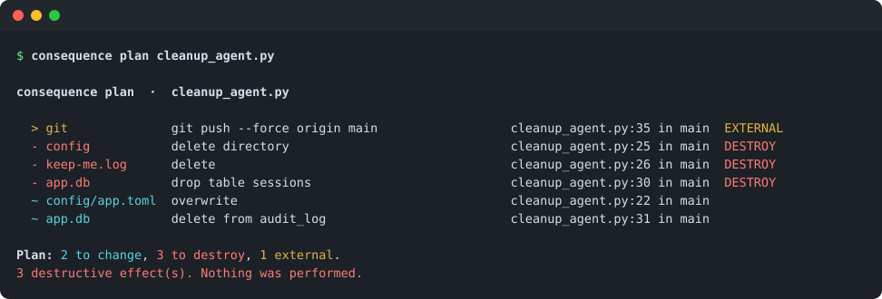
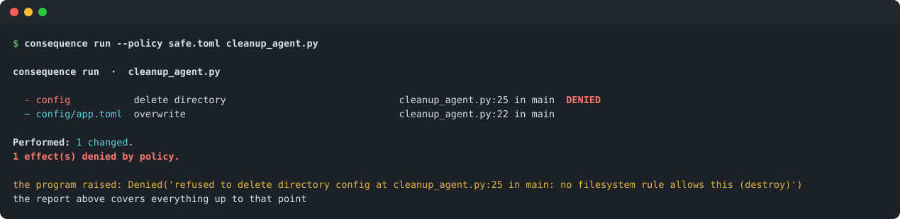
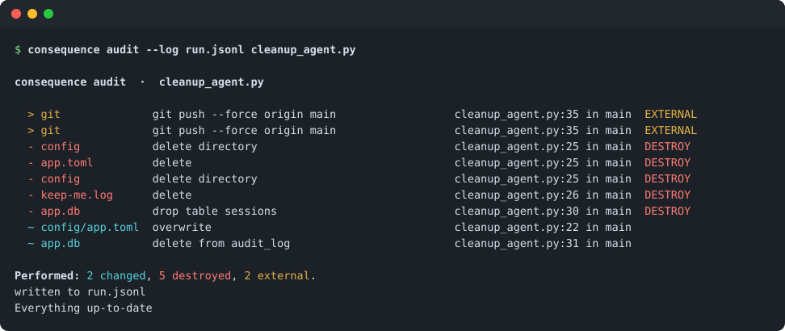

# consequence

**See what your code would do before it does it.**

[](https://pypi.org/project/consequence/)
[](https://pypi.org/project/consequence/)
[](https://github.com/aviseth/consequence/actions/workflows/ci.yml)
[](LICENSE)



That script really ran. It read its config, branched on it, opened the database,
built its SQL. Nothing reached the disk, the network, or the table.

---

## Contents

- [Why this exists](#why-this-exists)
- [Install](#install)
- [Three modes](#three-modes)
- [Worked example: an agent tidies up](#worked-example-an-agent-tidies-up)
- [Worked example: a real migration tool](#worked-example-a-real-migration-tool)
- [What it sees](#what-it-sees)
- [Policies](#policies)
- [Using it in tests](#using-it-in-tests)
- [Using it in CI](#using-it-in-ci)
- [Python API](#python-api)
- [Command reference](#command-reference)
- [How it works](#how-it-works)
- [Check it yourself](#check-it-yourself)
- [The limit — read this one](#the-limit--read-this-one)
- [Troubleshooting](#troubleshooting)
- [Reporting a problem](#reporting-a-problem)
- [Contributing](#contributing)
- [Related work](#related-work)

---

## Why this exists

`terraform plan` works because Terraform owns every effect a run can have. It
knows what a resource is, so it can tell you what is about to change.

Python owns none of them. `shutil.rmtree` is a function call like any other, and
the same question — *what is this about to do* — has no answer. The usual
substitutes are a `--dry-run` flag somebody has to remember to implement
correctly on every code path, or reading the code and hoping.

That got harder to live with once code started arriving faster than anyone could
read it. An agent hands you forty lines that look reasonable. There is an
`rmtree` in there somewhere, on a path assembled three functions away from where
it is used. You can read it carefully every time, or you can run it and find out.

This gives you the third option.

## Install

```bash
pip install consequence
```

or

```bash
uv add consequence
```

Python 3.10 and up. Linux, macOS and Windows, all tested in CI. The only
dependency is `tomli`, and only on 3.10 — from 3.11 the standard library has
`tomllib`. A tool you reach for because you are nervous should not bring a
dependency tree with it.

## Three modes

### `plan` — nothing reaches the outside world

```python
import consequence

with consequence.plan() as run:
    deploy()

run.print()
```

Writes land in a copy-on-write overlay, so when the program reads back the config
it just wrote, it gets what it wrote. This matters more than it sounds. Programs
write-then-read constantly, and a dry run that simply swallows writes sends the
program down a branch the real run would never take, then describes that branch
to you as if it were the plan.

### `guard` — effects happen, but only the ones a policy allows

```python
with consequence.guard("safe.toml"):
    agent.run(task)
```



Anything the policy does not allow raises `Denied` at the line that tried it,
naming the rule that refused. Everything before that point really happened, which
is the honest shape of a policy failure and not something to paper over.

### `audit` — everything happens, and everything is written down

```bash
consequence audit --log run.jsonl deploy.py
consequence log run.jsonl --destructive
```



## Worked example: an agent tidies up

`examples/cleanup_agent.py` is the kind of script you get when you ask something
to tidy up a project. It is not malicious. It is plausible, and it is wrong in
one specific way, and you cannot see which way by reading it quickly:

```python
def main() -> None:
    root = Path.cwd()

    config = root / "config" / "app.toml"
    config.write_text("[app]\ndebug = false\nworkers = 8\n")

    shutil.rmtree(root / "config")  # <- there it is
    (root / "keep-me.log").unlink()

    connection = sqlite3.connect(root / "app.db")
    connection.execute("DROP TABLE IF EXISTS sessions")
    connection.execute("DELETE FROM audit_log WHERE created_at < date('now', '-30 days')")
    connection.commit()

    subprocess.run(["git", "push", "--force", "origin", "main"], check=False)
```

It writes the config, then deletes the directory containing it. Run it and you
find out. Plan it and you are told — see the screenshot at the top of this page.

Try it:

```bash
git clone https://github.com/aviseth/consequence
cd consequence
uv run python examples/setup_demo.py
cd examples/demo
consequence plan cleanup_agent.py
```

## Worked example: a real migration tool

The demo above was written alongside this package, which makes it weak evidence.
Here it is against [`sqlstep`](https://github.com/aviseth/sqlstep), a migration
runner that has never heard of `consequence`, applying three real migrations to
a real SQLite database:

```console
$ consequence plan -m sqlstep -- --url sqlite:///app.db up

  - app.db              drop table legacy_sessions      drivers.py:175 in run_sql  DESTROY
  + app.db              create table schema_migrations  drivers.py:147 in ensure_table
  + app.db              create table users              drivers.py:175 in run_sql
  + app.db              create index idx_users_email    drivers.py:175 in run_sql
  + app.db              insert into schema_migrations   drivers.py:164 in record
  + app.db              create table orders             drivers.py:175 in run_sql
  + app.db              insert into users               drivers.py:175 in run_sql
  + app.db              insert into orders              drivers.py:175 in run_sql
  ...

Plan: 11 to create, 1 to destroy.
1 destructive effect(s). Nothing was performed.
```

One line in one migration drops a table. That is the thing you wanted to know
before running it against production, and it is the thing that is easiest to miss
in a directory of `.sql` files. Afterwards, `app.db` does not exist.

## What it sees

| domain | covered |
| --- | --- |
| files | read, write, append, delete, move, copy, truncate, chmod |
| directories | create, delete, delete tree |
| processes | `subprocess.run`/`call`/`check_call`/`check_output`/`Popen`, `os.system`, `os.kill` |
| network | `socket.connect`, `socket.connect_ex`, `http.client` requests |
| databases | SQLite — every statement, through the authorizer |
| environment | `os.environ` assignment |

Every effect carries the line that caused it, filtered down to code you wrote —
not the stdlib frame twelve levels down where the write actually happened.

Effects are graded, and the report sorts by grade so the line that deletes a
directory is never below the line that wrote a log file:

| mark | severity | meaning |
| --- | --- | --- |
| `.` | read | observes without changing |
| `+` | create | adds something that was not there |
| `~` | modify | changes something that existed |
| `-` | destroy | removes something; not reversible without a copy |
| `>` | external | reaches a system you do not own |

## Policies

TOML, and small enough to read in one go.

```toml
# What this program may do. Anything not listed is refused.
default = "deny"

[filesystem]
read   = ["**"]
write  = ["./build/**", "./config/*.toml"]
delete = ["./build/**"]

[process]
allow = ["git status*", "git diff*"]

[network]
allow = ["api.github.com"]

[database]
allow = ["delete from audit_log", "insert into *"]
allow_schema_changes = false
```

Three rules, all load-bearing.

**Deny beats allow.** A path matching both is denied, so the meaning of a policy
never depends on the order the rules happen to be written in. Nobody can review
order-dependent safety.

**There is no implicit default.** You write `allow` or `deny`, and a policy
without one is an error rather than a guess. `allow` is a monitoring posture;
`deny` is a containment one. Choosing on your behalf is how a policy ends up
meaning something nobody intended.

**`*` does not cross a `/`; `**` does.** Otherwise `/etc/*` matches
`/etc/nginx/nginx.conf` and the policy is far more permissive than it reads.

Filesystem rules are path globs and take the verbs `read`, `write` and `delete`.
Every other domain takes `allow` and `deny`, matched against the target, the
detail, or both together — so `git` names the program and `git status*` names the
command, and you do not have to know which one the interceptor recorded where.

## Using it in tests

```python
def test_rendering_is_pure(no_effects):
    render_invoice(rows)  # fails the test if it touches anything


def test_the_build_stays_put(effects, tmp_path):
    build(tmp_path)
    effects.assert_only_under(tmp_path)


def test_nothing_shells_out(effects):
    parse(document)
    effects.assert_no("process.spawn")
```

Available on the `effects` recorder: `assert_none()`, `assert_only_under(*roots)`,
`assert_no(kind)`, `assert_nothing_destructive()`, plus `.effects` and `.writes()`
if you want to look yourself.

Tests that quietly write outside their `tmp_path` pass alone, pass in CI, and then
fail six months later because two of them raced on the same file in somebody's
home directory.

Only the test's own effects count. pytest is busy during a test — creating
`tmp_path`, setting `PYTEST_CURRENT_TEST`, writing `__pycache__` entries — and
none of that is the test's doing. An effect counts if the test file appears
somewhere in its call stack, so helpers you call are included and fixtures acting
on their own behalf are not.

`no_effects` checks at teardown rather than blocking each write as it happens, so
a failure shows you everything the test wanted to do instead of stopping at the
first one. The cost is that pytest reports it as an error on a passing test. Call
`effects.assert_none()` yourself if you would rather it fail in the body.

## Using it in CI

`check` plans and exits non-zero if anything would be destroyed.

```yaml
- run: pip install consequence
- run: consequence check --policy ci.toml scripts/migrate.py
```

| exit code | meaning |
| --- | --- |
| 0 | nothing blocking |
| 1 | something destructive, or denied by policy, or the program failed |
| 2 | consequence itself could not proceed — bad policy, missing file |
| 130 | interrupted |

`--allow-destructive` narrows `check` to policy denials only, for a program whose
job genuinely is to delete things.

## Python API

```python
import consequence

# --- sessions -------------------------------------------------------------
consequence.plan(policy=None, network="block")  # nothing escapes
consequence.guard(policy)  # policy, or a path to one
consequence.audit(policy=None)  # watch, do not stop

# --- reading a run --------------------------------------------------------
with consequence.audit() as run:
    do_the_thing()

run.effects  # every Effect, in order
run.destructive  # the ones you cannot undo
run.denied  # the ones policy refused
run.where("file.write", min_severity=consequence.Severity.MODIFY)
run.counts()  # {"file.write": 3, "net.request": 1}
run.to_json()  # plain dicts, for a log
run.report()  # the text the CLI would print
run.print()
```

An `Effect` carries `kind`, `target`, `detail`, `severity`, `allowed`, `reason`,
`performed`, `origin` (the call site) and `frames` (the trimmed stack).

`Denied` is raised at the offending line in guard mode. `Blocked` is raised when
plan mode is asked to do something it cannot honestly simulate — reaching the
network is the only one.

## Command reference

```
consequence plan   [--policy P] [--network block|allow] [--show-reads] [--limit N] [--json] TARGET
consequence run     --policy P  [--show-reads] [--limit N] [--json] TARGET
consequence check  [--policy P] [--allow-destructive] [--network ...] [--json] TARGET
consequence audit  [--policy P] [--log FILE] [--json] TARGET
consequence log     FILE [--kind KIND] [--destructive] [--json]
```

`TARGET` is a script path or `-m module`. Arguments for the program go after `--`:

```bash
consequence plan -m mypkg.cli -- --force --output build/
```

`run` requires a `--policy`. Running for real with nothing able to say no is what
`audit` is for, so it refuses rather than quietly doing the harmless thing.

## How it works

Interception happens at the lowest layer that still knows what is going on.
Patching `os.unlink` catches `Path.unlink` and `shutil.rmtree` for free, because
they both call it; patching `Path.unlink` as well would count the same deletion
twice. The exceptions are `subprocess` and `sqlite3`, where the interesting
detail — the argv, the statement — only exists at the top layer and is gone by
the time anything reaches a syscall.

**SQLite goes through the authorizer callback**, not through string matching on
your SQL. SQLite calls it while preparing each statement, with the action code
and table name already parsed. That cannot be fooled by unusual SQL, it sees
statements issued through any API including `executescript` and triggers, and
refusal happens inside the engine rather than in a wrapper somebody could bypass.
In plan mode your connection is an in-memory copy of the real database, seeded
with `backup()`, so `INSERT` then `SELECT` returns the row and the file on disk
never opens for writing.

**Failure is loud.** If an interceptor cannot be installed, `install()` raises
rather than continuing. An earlier version suppressed that, and reported a clean
plan for a program that dropped a table.

**Everything is restored on exit**, including when the body raises. Nested
sessions share one set of patches and are reference counted, so an inner session
leaving does not strip the interceptors out from under an outer one.

## Check it yourself

You should not take the last section on faith. `examples/fidelity_check.py` runs
your own program twice from identical copies — once planned, once for real — and
compares:

```bash
python examples/fidelity_check.py --seed ./project -- -m mypkg up
```

```
planned 15 effect(s); the real run had 15

safety    the plan changed nothing on disk
fidelity  every one of the 13 real effect(s) was predicted
```

*safety* is a content hash of every file before and after the plan. *fidelity* is
whether the plan predicted everything the real run actually did. Point it at a
copy: the second run is real.

## The limit — read this one

**This is not a sandbox.** It is in-process. The interceptors are patched into
`builtins`, `os`, `shutil`, `subprocess`, `socket` and `sqlite3` in the same
interpreter as your program. Code that goes around them is neither seen nor
stopped:

- a C extension calling `unlink(2)` directly
- `ctypes` into libc
- a fork that re-execs
- anything that captured a reference to the original function before the session
  started

So: run it on code you are unsure about, not on code you believe is hostile. For
hostile code you want a container, a VM, or seccomp — and those will not tell you
what the code was trying to do. That is the trade, and it is exactly what lets
plan mode hand a program its own writes back.

Two smaller limits worth knowing:

**Plan mode refuses network calls** rather than inventing replies, because a
fabricated response sends the program somewhere the real one would not go. Pass
`network="allow"` (or `--network allow`) when a read has to succeed for the plan
to reach anything interesting.

**Plan mode copies a SQLite database into memory**, and will not do so above
512 MB. Above that, use audit mode against a restored snapshot.

## Troubleshooting

**The plan is empty.** The program probably did not run. Check for a
`the program raised:` line under the report — a module that fails to import
produces a truthful plan of nothing at all.

**A write I expected is missing.** Was it done by a C extension, or by a library
holding a reference to `open` captured at import time? See
[the limit](#the-limit--read-this-one).

**`Blocked: plan mode cannot simulate`.** Something reached for the network.
Either pass `--network allow`, or stub the client.

**`InterceptionFailed`.** Something has already replaced one of the functions
this patches, or an object refused the assignment. It is raised rather than
swallowed on purpose: a missing interceptor means a plan that understates what
your code does.

**A policy allows nothing on Windows.** Fixed in 0.1.0 — patterns are written
with forward slashes on every platform. If you still see it, please open an issue
with the pattern and the path.

**Everything is denied.** A policy's `default` is required. If you meant to watch
rather than to stop, that is `default = "allow"`.

## Reporting a problem

[Open an issue](https://github.com/aviseth/consequence/issues/new/choose).

The most useful bug report for this project is a **plan that lied** — an effect
that happened for real but was missing from the plan, or one that was reported
but never happens. Those are the bugs that matter here, and they are the ones
worth interrupting your day to write up. If you can, include:

- the smallest program that shows it
- `consequence plan --json` output, and what the real run did
- your OS and `python -V`

`examples/fidelity_check.py` produces most of that automatically.

Security-relevant reports: please use [private vulnerability
reporting](https://github.com/aviseth/consequence/security/advisories/new)
rather than a public issue. Note that "code escaped interception" is a known and
documented limitation rather than a vulnerability — see
[the limit](#the-limit--read-this-one).

## Contributing

Contributions are welcome, and the bar is honest work rather than perfect work.
See [CONTRIBUTING.md](CONTRIBUTING.md) for the full version. The short one:

```bash
git clone https://github.com/aviseth/consequence
cd consequence
uv sync
uv run pytest
uv run ruff check . && uv run ruff format --check . && uv run mypy
```

Good first contributions, in rough order of how much they would help:

- **A new interceptor.** `os.link`, `os.symlink` and `shutil.chown` are covered;
  `mmap`, `os.sendfile` and `pathlib` on future versions are not. The pattern is
  in `intercept.py` and each one is about fifteen lines and two tests.
- **Another database.** SQLite is done properly through the authorizer. Postgres
  and MySQL would need a different approach — probably at the driver's `execute`
  — and the design conversation is worth having in an issue first.
- **A fidelity bug**, with a failing test. The most valuable kind.
- **Policy expressiveness**, carefully. Every feature added here is a new way for
  a policy to mean something its author did not intend.

Two conventions worth knowing before you send a patch. Tests are named as
sentences describing the behaviour, not `test_foo_returns_bar`. And comments
explain *why*, especially where the obvious approach was tried first and did not
work — several of the ones in `intercept.py` and `databases.py` are tombstones
for real bugs, and they are there so nobody re-introduces them.

## Related work

| tool | what it does differently |
| --- | --- |
| `terraform plan` | the obvious ancestor; owns its effects, so it does not have to intercept anything |
| `strace`, `dtruss` | see far more, at the syscall layer, after the fact, with no plan and no policy |
| `pytest-socket` | one domain, in tests |
| `pyfakefs` | one domain, in tests, by replacing the filesystem wholesale |
| containers, seccomp | a real boundary, and no idea what happened inside it |

## Licence

MIT. See [LICENSE](LICENSE).
